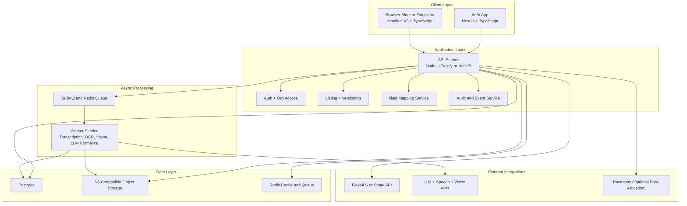
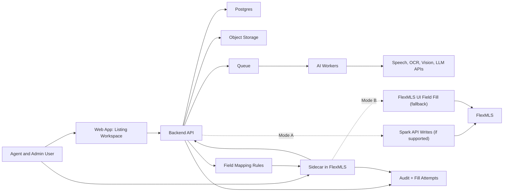
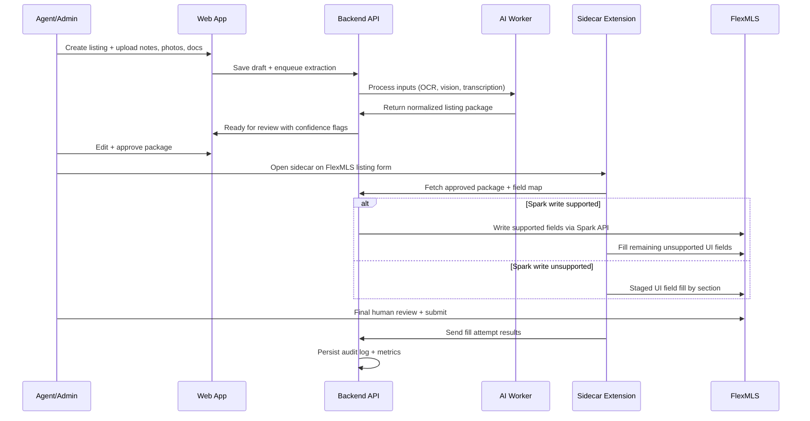

# MLS App Architecture Diagrams

Date: 2026-04-19
Scope: Michigan + FlexMLS v1

## 1) Tech Stack (Layered)

```mermaid
flowchart TB
  subgraph Client[Client Layer]
    WEB["Web App<br/>Next.js + TypeScript"]
    EXT["Browser Sidecar Extension<br/>Manifest V3 + TypeScript"]
  end

  subgraph AppLayer[Application Layer]
    BFF["API Service<br/>Node.js Fastify or NestJS"]
    AUTH["Auth + Org Access"]
    LISTING["Listing + Versioning"]
    MAP["Field Mapping Service"]
    AUDIT["Audit and Event Service"]
  end

  subgraph Async[Async Processing]
    QUEUE["BullMQ and Redis Queue"]
    WORKER["Worker Service<br/>Transcription, OCR, Vision, LLM Normalize"]
  end

  subgraph Data[Data Layer]
    PG["Postgres"]
    S3["S3-Compatible Object Storage"]
    REDIS["Redis Cache and Queue"]
  end

  subgraph External[External Integrations]
    FLEX["FlexMLS or Spark API"]
    LLM["LLM + Speech + Vision APIs"]
    PAY["Payments (Optional Post-Validation)"]
  end

  WEB --> BFF
  EXT --> BFF

  BFF --> AUTH
  BFF --> LISTING
  BFF --> MAP
  BFF --> AUDIT

  BFF --> PG
  BFF --> S3
  BFF --> REDIS

  BFF --> QUEUE
  QUEUE --> WORKER
  WORKER --> LLM
  WORKER --> PG
  WORKER --> S3

  BFF --> FLEX
  BFF --> PAY
```

## 2) System Architecture (Runtime)

```mermaid
flowchart LR
  U["Agent and Admin User"] --> WEB["Web App: Listing Workspace"]
  U --> EXT["Sidecar in FlexMLS"]

  WEB --> API["Backend API"]
  EXT --> API

  API --> DB["Postgres"]
  API --> OBJ["Object Storage"]
  API --> Q["Queue"]
  Q --> W["AI Workers"]
  W --> AI["Speech, OCR, Vision, LLM APIs"]

  API --> MAP["Field Mapping Rules"]
  MAP --> EXT

  API -. "Mode A" .-> SPARK["Spark API Writes (if supported)"]
  EXT -. "Mode B" .-> FLEXUI["FlexMLS UI Field Fill (fallback)"]

  SPARK --> FLEX["FlexMLS"]
  FLEXUI --> FLEX

  API --> LOG["Audit + Fill Attempts"]
  EXT --> LOG
```

## 3) Listing-to-MLS Flow

```mermaid
sequenceDiagram
  participant User as Agent/Admin
  participant Web as Web App
  participant API as Backend API
  participant Worker as AI Worker
  participant Ext as Sidecar Extension
  participant MLS as FlexMLS

  User->>Web: Create listing + upload notes, photos, docs
  Web->>API: Save draft + enqueue extraction
  API->>Worker: Process inputs (OCR, vision, transcription)
  Worker->>API: Return normalized listing package
  API->>Web: Ready for review with confidence flags
  User->>Web: Edit + approve package

  User->>Ext: Open sidecar on FlexMLS listing form
  Ext->>API: Fetch approved package + field map

  alt Spark write supported
    API->>MLS: Write supported fields via Spark API
    Ext->>MLS: Fill remaining unsupported UI fields
  else Spark write unsupported
    Ext->>MLS: Staged UI field fill by section
  end

  User->>MLS: Final human review + submit
  Ext->>API: Send fill attempt results
  API->>API: Persist audit log + metrics
```
